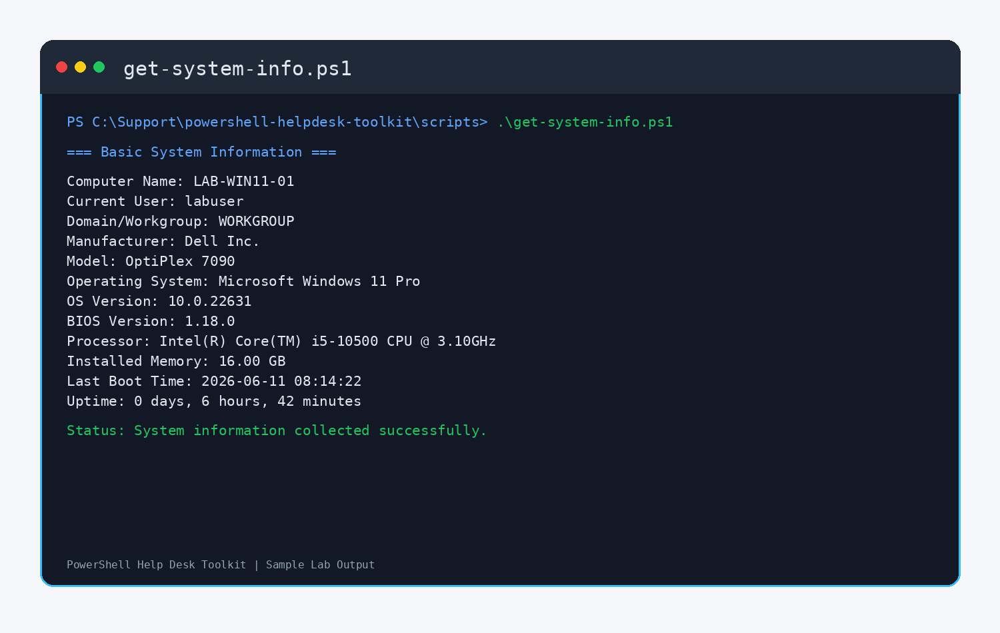
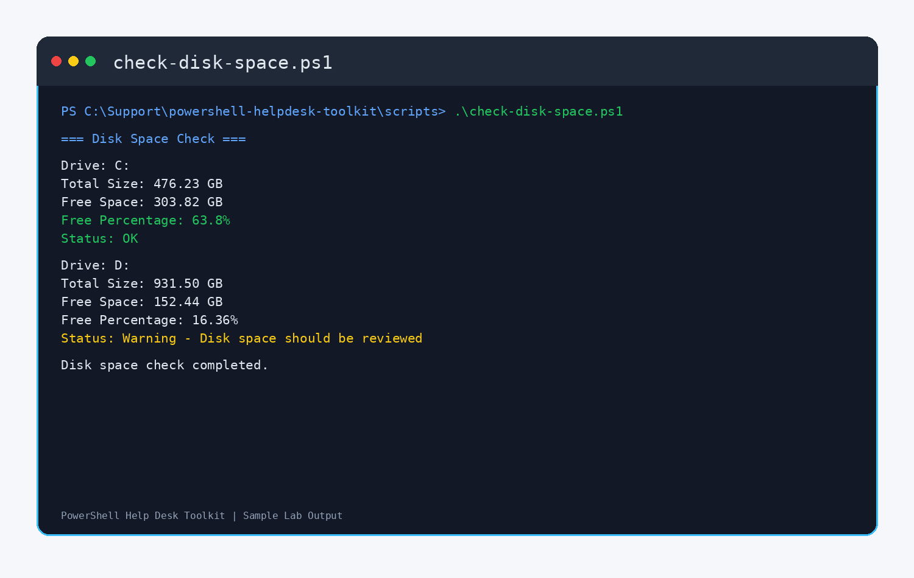
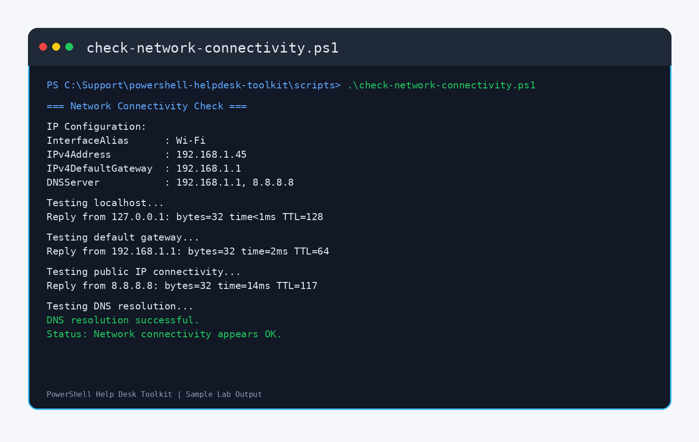
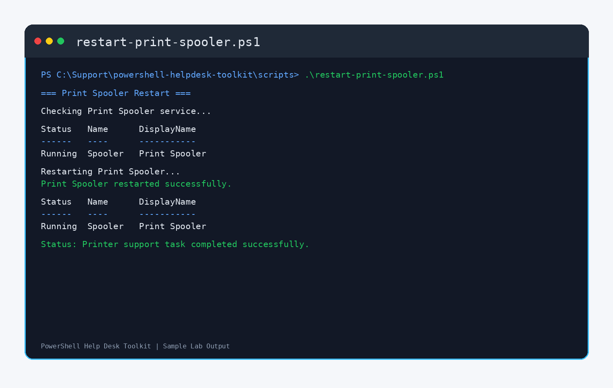
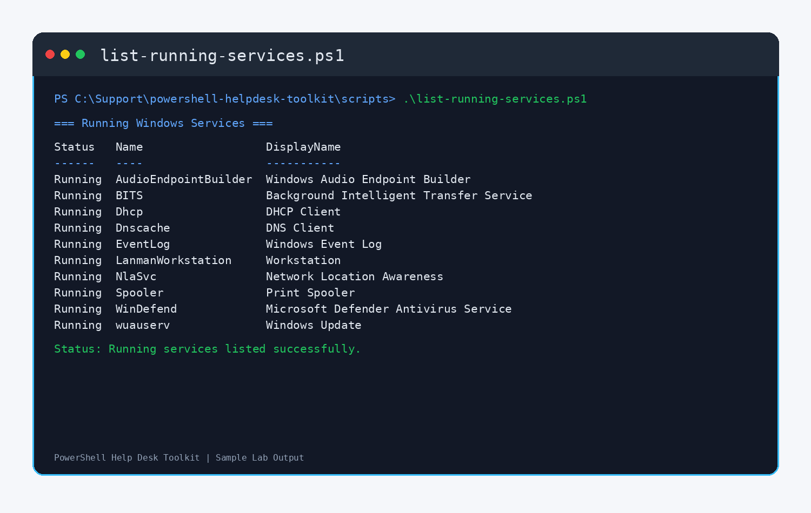
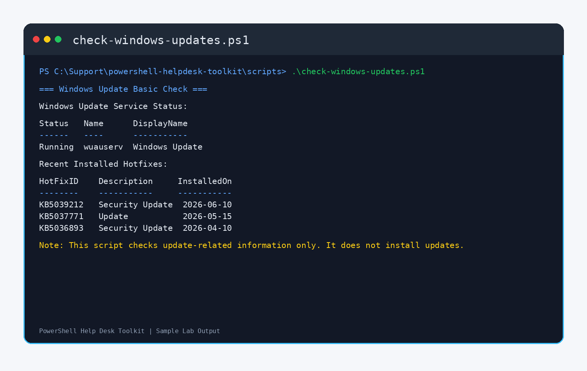
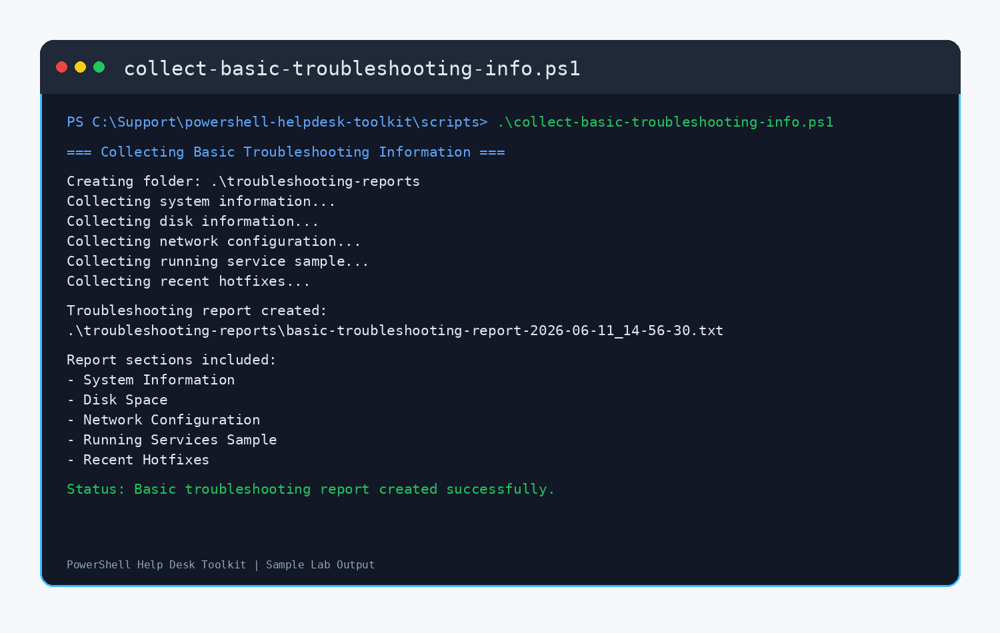

# README Screenshot Section

Add this section to your `powershell-helpdesk-toolkit` README.md:

```markdown
## Script Output Screenshots

These screenshots show sample lab output from the PowerShell Help Desk Toolkit scripts. The data shown is sanitized and used for portfolio demonstration purposes only.

### System Information Script



### Disk Space Check Script



### Network Connectivity Check Script



### Print Spooler Restart Script



### Running Services Script



### Windows Update Check Script



### Basic Troubleshooting Report Script


```

Recommended commit message:

```text
Add PowerShell script output screenshots
```
